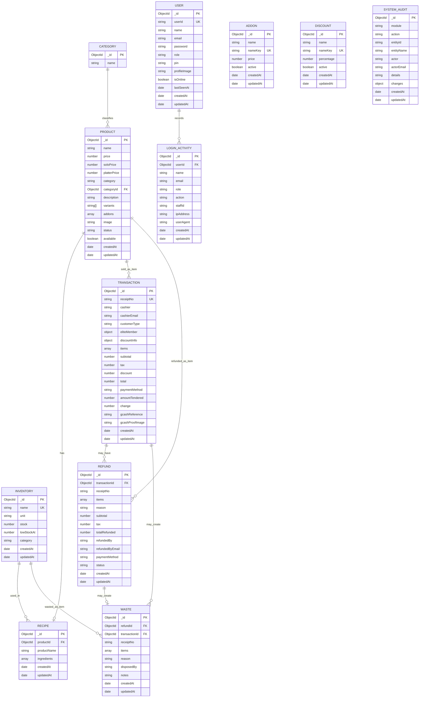

# FLUX POS Entity Relationship Diagram

This ERD is based on the current MongoDB/Mongoose models used by the FLUX POS system.

## Main Relationships

- One category can have many products.
- One product can have one recipe.
- One recipe can contain many inventory ingredients.
- One transaction can contain many sold products.
- One transaction can have many refunds.
- One refund can create one waste record.
- One waste record can contain many wasted inventory items.
- One user can have many login activity records.

## Notes

- `Transaction.items`, `Refund.items`, `Waste.items`, `Product.addons`, and `Recipe.ingredients` are embedded arrays in MongoDB.
- `receiptNo` is retained as the internal field name in the database, but the UI displays it as `Slip No`.
- `SystemAudit` is a flexible audit table. It stores the affected entity through `entityId` and `entityName` instead of a strict foreign key.
